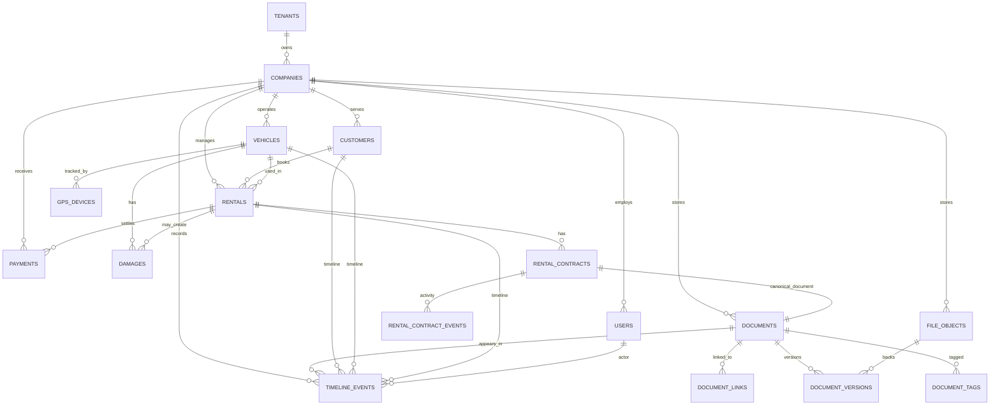

# FleetCore Information Architecture

This document defines the target information architecture for FleetCore at the level expected from mature SaaS products such as Salesforce, HubSpot, Fleetio, and modern fleet/rental platforms.

## Current Audit

FleetCore already has the right MVP foundations:

- B2B tenant model: `tenants`, `companies`, `users`.
- Core operations: `customers`, `vehicles`, `rentals`, `invoices`, `payments`, `gps_devices`.
- Rental workflow: `rental_contracts`, `rental_contract_events`, `rental_contract_links`, `rental_checklists`.
- Document primitives: `vehicle_documents`, `customer_documents`, `file_objects`.

The main structural problem is document fragmentation. A vehicle insurance file, customer passport, rental agreement, uploaded folder file, and contract PDF currently live in separate concepts. This creates duplicates, weak search, inconsistent expiry reminders, and difficult reporting at scale.

## Core Entities

### Tenant

Top-level SaaS workspace. All business data belongs to one tenant.

### Company

Operating business inside a tenant. Most FleetCore deployments will have one company per tenant, but the schema should allow more.

### User

Owner or manager account.

Recommended roles:

- `owner` - subscription, team, billing, all operations.
- `manager` - daily operations.

### Customer

Person or business renting vehicles.

Owns:

- identity data;
- contact data;
- risk profile;
- documents;
- rental history;
- payment history;
- timeline.

### Vehicle

Fleet asset.

Owns:

- VIN, plate, make, model, year;
- status;
- odometer;
- rental rate;
- GPS state;
- documents;
- damages;
- service history;
- timeline.

### Rental

Commercial transaction between company, customer, and vehicle.

Owns:

- pickup/return schedule;
- lifecycle status;
- contract;
- checklist;
- deposit;
- invoice/payment settlement;
- damage events;
- timeline.

### Contract

Specialized document workflow for rental agreements.

Owns:

- generation status;
- delivery channel;
- public link;
- opened/signed events;
- PDF file reference.

### Document

Business document record. This is not the raw binary file. It is the searchable, categorized business object.

Examples:

- passport;
- driver license;
- vehicle registration;
- insurance;
- inspection;
- rental agreement;
- return act;
- deposit receipt;
- damage report;
- service invoice.

### File Object

Physical file blob or object-storage pointer.

Examples:

- PDF bytes;
- JPEG passport image;
- PNG vehicle photo;
- signed agreement PDF.

### Payment

Money event tied to invoice, rental, customer, and company.

Examples:

- rental payment;
- deposit capture;
- deposit refund;
- extra charge;
- damage fee.

### Damage

Damage case attached to vehicle and optionally rental/customer.

Owns:

- severity;
- photos;
- description;
- estimated cost;
- charged amount;
- resolution status.

### GPS

Latest device state plus later trip/history extension.

Owns:

- provider/device id;
- vehicle;
- online/offline state;
- last coordinates;
- speed;
- last signal.

## Relationships

High-level relationship rules:

- Tenant has many companies.
- Company has many users, customers, vehicles, rentals, documents, payments.
- Customer has many rentals, documents, payments, timeline events.
- Vehicle has many rentals, documents, GPS points, service records, damage cases, timeline events.
- Rental belongs to one customer and one vehicle.
- Rental has one or more contracts.
- Contract references one canonical document and one canonical file.
- Document can link to many business entities without duplication.
- File object can be reused by document versions.

## ERD



## Target DMS

Implementation status: the first production-safe DMS migration is implemented in `infra/postgres/migrations/0019_unified_dms.sql`. It adds the canonical tables, backfills legacy vehicle/customer/contract documents, and keeps legacy tables online for compatibility while the frontend is migrated.

FleetCore should use one DMS instead of separate vehicle/customer/rental document tables.

### Tables

#### `documents`

Canonical business document.

Recommended columns:

- `id`
- `tenant_id`
- `company_id`
- `document_number`
- `title`
- `category`
- `type`
- `status`
- `source`
- `owner_user_id`
- `current_version_id`
- `issued_at`
- `expires_at`
- `verified_at`
- `archived_at`
- `search_text`
- `metadata jsonb`
- `created_at`
- `updated_at`

Recommended categories:

- `customer_identity`
- `vehicle_compliance`
- `rental_contract`
- `rental_handover`
- `payment`
- `damage`
- `service`
- `company`
- `other`

Recommended statuses:

- `draft`
- `pending_review`
- `valid`
- `expired`
- `rejected`
- `archived`

#### `document_versions`

Immutable file versions.

Recommended columns:

- `id`
- `tenant_id`
- `company_id`
- `document_id`
- `file_object_id`
- `version_number`
- `sha256`
- `mime_type`
- `size_bytes`
- `created_by_user_id`
- `created_at`

Rule: never overwrite a document file. Add a new version.

#### `document_links`

Polymorphic relation from one document to one or more business entities.

Recommended columns:

- `id`
- `tenant_id`
- `company_id`
- `document_id`
- `entity_type`
- `entity_id`
- `relation_type`
- `created_at`

Allowed `entity_type`:

- `customer`
- `vehicle`
- `rental`
- `contract`
- `invoice`
- `payment`
- `damage`
- `service_record`
- `company`

Examples:

- Driver license linked to `customer`.
- Rental agreement linked to `rental`, `customer`, `vehicle`, and `contract`.
- Damage photo linked to `damage`, `rental`, and `vehicle`.

#### `document_tags`

Normalized tags.

Recommended columns:

- `id`
- `tenant_id`
- `company_id`
- `document_id`
- `tag`
- `created_at`

Examples:

- `gdpr`
- `passport`
- `signed`
- `deposit`
- `bmw-x5`
- `warsaw`
- `high-risk`

#### `document_events`

Document-specific audit trail.

Recommended columns:

- `id`
- `tenant_id`
- `company_id`
- `document_id`
- `actor_user_id`
- `event_type`
- `channel`
- `metadata jsonb`
- `created_at`

Examples:

- `uploaded`
- `linked`
- `sent`
- `opened`
- `signed`
- `verified`
- `expired`
- `archived`

### File Storage

`file_objects` should become metadata only.

Recommended object key:

```text
tenant/{tenantId}/company/{companyId}/documents/{documentId}/v{version}/{sha256}.{ext}
```

Storage providers:

- `s3`
- `cloudflare_r2`
- `google_cloud_storage`
- `database` only for local development

Rules:

- Store file bytes in object storage.
- Store metadata and access policy in PostgreSQL.
- Use signed URLs for downloads and previews.
- Deduplicate by `(tenant_id, company_id, sha256)`.
- Scan uploaded customer IDs and contracts before marking them valid.

## Eliminating Document Duplication

Current duplication risk:

- `vehicle_documents` duplicates vehicle-related document metadata.
- `customer_documents` duplicates customer identity document metadata.
- `rental_contracts.document_url` duplicates contract document location.
- `file_objects` can contain raw files without strong business categorization.

Target rule:

One uploaded file creates:

1. One `file_object`.
2. One `document_version`.
3. One `document`.
4. One or more `document_links`.

The same contract PDF should not be copied into customer, vehicle, and rental folders. It should be one document with three links.

## Timeline Architecture

Timeline should be a first-class cross-entity layer.

### `timeline_events`

Recommended columns:

- `id`
- `tenant_id`
- `company_id`
- `entity_type`
- `entity_id`
- `actor_user_id`
- `event_type`
- `title`
- `description`
- `occurred_at`
- `metadata jsonb`
- `created_at`

Common event types:

- `customer_created`
- `vehicle_created`
- `rental_created`
- `rental_started`
- `contract_sent`
- `contract_opened`
- `contract_signed`
- `document_uploaded`
- `document_verified`
- `payment_received`
- `deposit_refunded`
- `damage_reported`
- `gps_signal_lost`
- `service_completed`

### Timeline Views

Customer timeline:

- profile changes;
- uploaded ID/passport/license;
- rentals;
- contracts;
- payments;
- damages;
- notes.

Vehicle timeline:

- rentals;
- documents;
- inspections;
- service records;
- damages;
- GPS signal issues.

Rental timeline:

- booking;
- contract generation;
- link sent;
- opened;
- signed;
- deposit;
- pickup checklist;
- return checklist;
- final settlement.

## Search And Filters

### Search

Use PostgreSQL full-text search for MVP:

- `documents.search_text`
- `to_tsvector('simple', search_text)`
- GIN index

Search fields:

- title;
- document number;
- customer name;
- plate number;
- VIN;
- rental id;
- tags;
- category;
- file name.

Later upgrade path:

- Meilisearch or OpenSearch when cross-tenant document search becomes heavy.

### Filters

Document Center filters:

- category;
- type;
- status;
- tag;
- linked entity;
- expiry range;
- uploaded by;
- created date;
- file type;
- missing/expired/needs review.

Saved views:

- Expiring in 30 days.
- Missing customer IDs.
- Missing vehicle insurance.
- Unsigned contracts.
- Return acts pending.
- Damage reports unpaid.

## Performance At 100 000 Documents And 10 000 Vehicles

### Database Strategy

Required indexes:

```sql
create index documents_company_category_status_idx
  on documents (tenant_id, company_id, category, status, created_at desc);

create index documents_company_expires_idx
  on documents (tenant_id, company_id, expires_at)
  where expires_at is not null and archived_at is null;

create index documents_search_idx
  on documents using gin (to_tsvector('simple', search_text));

create index document_links_entity_idx
  on document_links (tenant_id, company_id, entity_type, entity_id, document_id);

create index document_links_document_idx
  on document_links (tenant_id, company_id, document_id);

create unique index document_tags_unique_idx
  on document_tags (tenant_id, company_id, document_id, lower(tag));

create index vehicles_company_status_idx
  on vehicles (tenant_id, company_id, status, updated_at desc);

create index vehicles_company_plate_vin_idx
  on vehicles (tenant_id, company_id, plate_number, vin);
```

### Query Rules

- Never load all documents for a company.
- Every list endpoint must be paginated by cursor.
- Default page size: 25.
- Maximum page size: 100.
- All document counts should use indexed aggregates or cached counters.
- Timeline should be paginated by `occurred_at desc, id desc`.
- Search should debounce on the frontend and cancel stale requests.

### API Shape

Recommended endpoints:

```http
GET /documents?query=&category=&status=&tag=&entityType=&entityId=&cursor=&limit=
POST /documents
GET /documents/:documentId
PATCH /documents/:documentId
POST /documents/:documentId/versions
POST /documents/:documentId/links
DELETE /documents/:documentId/links/:linkId
GET /timeline?entityType=customer&entityId=cus_...
GET /vehicles?query=&status=&cursor=&limit=
GET /customers?query=&riskLevel=&cursor=&limit=
```

### UI Strategy

For 100 000 documents:

- Document Center opens with saved views, not a huge table.
- Search is server-side.
- Lists are virtualized on desktop.
- Mobile uses cards only.
- Document preview loads metadata first, file preview on demand.
- Expiry/reminder widgets use precomputed counts.

For 10 000 vehicles:

- Fleet page opens with operational segments: available, rented, overdue return, service, offline GPS.
- Vehicle search is server-side by plate/VIN/make/customer.
- Map loads only visible/active vehicles.
- GPS positions are clustered and fetched by bounding box.

## Recommended Migration Plan

### Phase 1: Add New DMS Tables

Add `documents`, `document_versions`, `document_links`, `document_tags`, `document_events`, `timeline_events`, `damages`.

Keep existing tables read-compatible.

Status: implemented in `0019_unified_dms.sql`.

### Phase 2: Backfill Existing Documents

Backfill:

- `vehicle_documents` into `documents` + `document_links`.
- `customer_documents` into `documents` + `document_links`.
- `rental_contracts` into `documents` + links to rental/customer/vehicle/contract.
- `file_objects` into `document_versions` where possible.

Status: legacy vehicle documents, customer documents, and rental contracts are backfilled. File versions remain the next storage migration because existing legacy rows primarily store URLs, not canonical file object ids.

### Phase 3: Move UI To Document Center

Replace separate document lists with one Document Center using category tabs and saved views.

### Phase 4: Deprecate Old Tables

Stop writing to:

- `vehicle_documents`
- `customer_documents`
- direct `rental_contracts.document_url`

Keep views or compatibility endpoints until the frontend is fully migrated.

### Phase 5: Scale Storage

Move binary data out of PostgreSQL into S3/R2/GCS. Keep `database` storage only for local development.

## Product Result

The user experience becomes:

- customer profile has one clear document tab and one timeline;
- vehicle profile has compliance documents, service, damage, GPS, and timeline;
- rental details show one workflow from booking to final settlement;
- document center becomes the single source of truth;
- global search can find customer, vehicle, rental, contract, payment, and document without guessing where it was uploaded.
